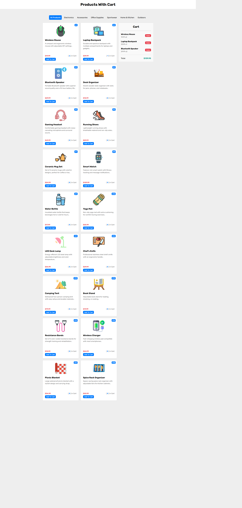

# 🛒 Products Cart Application

## 📌 Description
A simple e-commerce application built with **JavaScript, HTML, and CSS**.  
It fetches products from a JSON file, displays them with categories, and allows users to add/remove items from a cart. The cart data is saved in **LocalStorage**, so it remains even after page reloads.

---

## 🚀 Live Demo
[👉 Demo Link](https://amelchenni.github.io/Products-with-Cart-App/)  

---

## 📷 Screenshots


---

## 🛠️ Technologies Used
- HTML5
- CSS3
- JavaScript (Vanilla)
- LocalStorage API

---

## ⚙️ Features
- 📂 Fetch products from `products.json`
- 📂 Filter products by categories
- ➕ Add products to cart
- ➖ Remove products from cart
- 💾 Save cart data in LocalStorage
- 💰 Calculate total price dynamically

---

## 🔮 Future Improvements
- [ ] Add search functionality to filter products by name  
- [ ] Add quantity increment/decrement buttons in cart  
- [ ] Improve responsive design (mobile-friendly)  
- [ ] Show "Cart Empty" message when no items  
- [ ] Add checkout page / confirmation modal  
- [ ] Add product rating system (stars)  
- [ ] Connect with real API instead of local `products.json`  

---

## 📄 Installation
1. Clone the repo:
   ```bash
   git clone https://github.com/AmelChenni/Products-with-Cart-App.git
   cd Products-with-Cart-App

